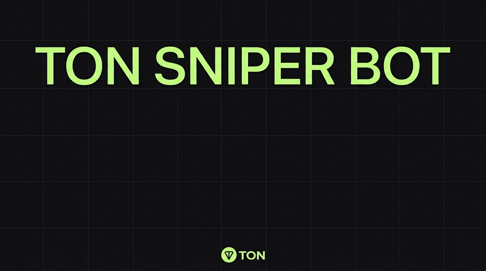

# 🎯 TON Sniper bot

**TON Sniper bot** is the ultimate desktop application for ultra-fast automated trading, copy trading, and token sniping on The Open Network (TON). 

Unlike popular Telegram bots, **we do not have access to your funds**. The application runs completely locally, providing an institutional level of security and transaction execution speed unattainable by cloud-based bots.

  

---

## ✨ Key Features

*   🔒 **Local Key Storage (Non-Custodial):** Your seed phrases and private keys are encrypted and remain exclusively on your hard drive. No external servers.
*   👥 **Advanced Copy Trading:** Track the wallets of "whales" and successful traders (Smart Money). The bot automatically mirrors their DEX trades in real-time with flexible volume settings.
*   📡 **Social Sniping (Telegram & Twitter Parser):** Automated monitoring of your specified TG channels and Twitter accounts. The bot instantly extracts the contract address from a new post and buys the token in milliseconds.
*   ⚡ **Multi-RPC Architecture:** Choose from 5+ premium and public RPC nodes (including Toncenter, GetBlock, Tonhub, etc.) with the ability to add your own custom nodes. The bot automatically selects the node with the lowest ping.
*   🚀 **Zero-Delay Sniping:** Direct interaction with DEX smart contracts (STON.fi, DeDust) to buy in the exact same block where liquidity was added.
*   🛡️ **Smart Anti-Scam Protection:** Built-in transaction simulation algorithms to detect Honeypot contracts and protect against Rug Pulls (liquidity lock verification).
*   📈 **Advanced Risk Management:** Automated Take-Profit, Stop-Loss, and Trailing-Stop triggers right out of the box.
*   🖥️ **Full-Featured UI:** Intuitive graphical user interface (GUI) with built-in charts and real-time analytics.

---

## ⚙️ Installation

### Windows
 
Download `TON-Sniper-x64.7z` from the [latest release](../../releases/latest) and double-click. The installer is digitally signed, so Windows SmartScreen passes it through without warnings. No Python, no Docker, no terminal. Install takes about a minute.
 
### Mac
 
Download `TON-Sniper-macOS.dmg` from the [latest release](../../releases/latest), open it, and drag TON-Sniper-macOS to your Applications folder. Signed and notarized with an Apple Developer ID — opens without Gatekeeper warnings.

---

## 🛠 Configuration

Upon the first launch of the application, you will be prompted to create a local profile:

1. **Wallet:** Create a new wallet directly within the app or import an existing one.
2. **Password:** Set a master password (AES-256 encryption).
3. **Network (RPC):** Select the fastest node from the 5+ provided options.
4. **Social Integrations:** In the `Settings -> Social API` section, enter your keys for Telegram and/or Twitter.

---

## 📖 How to Use

### Option 1: Classic Snipe
1. Go to the **Sniper** tab.
2. Paste the smart contract address of the expected token.
3. Specify the buy amount, `Slippage`, `Take Profit`, and `Stop Loss`.
4. Click **"Start Snipe"**. The application will begin monitoring liquidity pools.

### Option 2: Social Snipe
1. Go to the **Social Sniper** tab.
2. Add links to Telegram channels or Twitter accounts of influencers.
3. Set up filters (e.g., only search for messages containing the word "contract" or "CA").
4. Specify a fixed buy amount and risk management settings.
5. Click **"Start Listening"**. The bot will scan the sources every second and automatically buy the token upon detecting an address.

### Option 3: Copy Trading
1. Go to the **Copytrade** tab.
2. Add the public TON wallet addresses of successful traders to track (Target Wallets).
3. Configure the copy mode:
   * **Fixed Buy:** A fixed amount in TON for each copied trade.
   * **Proportional:** A percentage of the target wallet's trade amount.
4. Enable the **Auto-Sell** feature (optional) so the bot automatically sells the token when the target wallet does.
5. Set up protection filters (e.g., ignore tokens with a liquidity pool of less than 1000 TON).
6. Click **"Start Copying"**. The application will start analyzing the transactions of the specified wallets in the mempool and instantly mirror their actions.

---

## ⚠️ Disclaimer

This software is provided "as is". Sniping and copy trading are **highly risky types of trading**. 

**Pay special attention:** 
* When using **Social Sniping**, influencer accounts can be hacked to publish scam contracts. 
* When using **Copy Trading**, target wallets may employ special tactics (e.g., buying "junk" tokens to deceive copy traders). 

The developers are not responsible for any financial losses. Always do your own research (DYOR), use the built-in Anti-Scam filters, and only trade with funds you are prepared to lose.

---

## 📄 License

Distributed under the MIT License. See the `LICENSE` file for more information.
